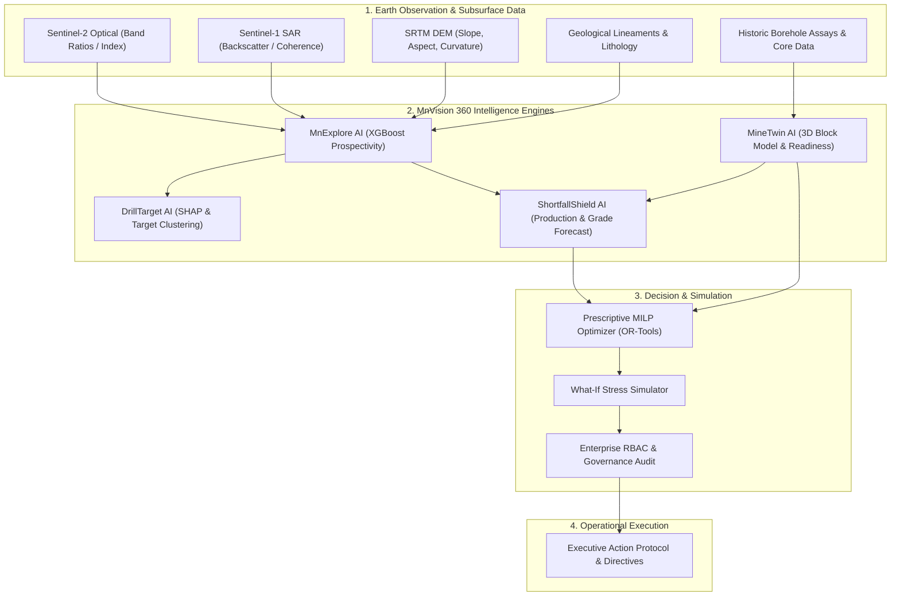
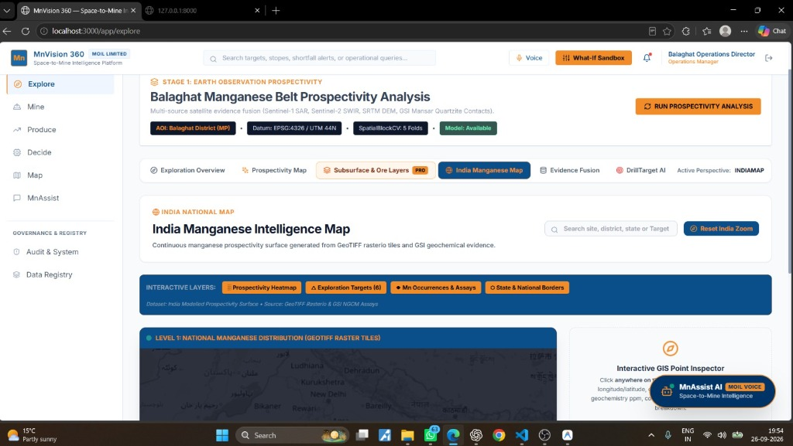

# MnVision 360 — Space-to-Mine Intelligence Platform

[](walkthrough.md)
[](README.md#implementation-status)
[](README.md#overview)

> **📖 Quick Navigation**: Jump directly to the complete operational workflow in the **[Full Walkthrough & SIH Demonstration Guide](walkthrough.md)**.

---

## Overview

**MnVision 360** is an enterprise-grade, decision-support Web GIS & AI platform tailored for **MOIL (Manganese Ore India Limited)**. It unifies satellite earth observation, multi-source geospatial prospectivity mapping, 3D underground block modeling, machine learning production forecasting, and prescriptive MILP (Mixed Integer Linear Programming) decision optimization into a single, closed-loop command center.

### Core Scientific Principle: Layered Prospectivity
The platform **never claims to directly detect underground manganese ore from satellite imagery**. Instead, it fuses surface earth observation (Sentinel-2 MSI, Sentinel-1 SAR, Landsat-9, SRTM DEM) with geological mapping, structural lineament density, geophysical magnetic anomalies, and historic borehole assays into an explainable, physics-calibrated prospectivity model.

---

## System Architecture & Data Flow



### 7-Step Operational Pipeline
`PREDICT` $\rightarrow$ `EXPLAIN` $\rightarrow$ `EVALUATE` $\rightarrow$ `OPTIMIZE` $\rightarrow$ `SIMULATE` $\rightarrow$ `DECIDE` $\rightarrow$ `LEARN`

---

## Platform Visual Tour & Core Modules

### 1. Unified Command Center & Landing Dashboard
*Executive entry point displaying live production throughput, active drill rigs, AI prospectivity alerts, and system telemetry across MOIL operational zones.*


---

### 2. MnExplore AI — Multi-Source Geospatial Prospectivity Map
*Interactive GIS map centered on the Balaghat Manganese Belt. Features satellite spectral indices, fault lineament density overlay, high-probability drill target heatmaps, and satellite view mode.*



**Key Features**:
- Satellite layer toggling (Satellite hybrid, SRTM DEM terrain, Prospectivity heatmap, Structural lineaments).
- SHAP (SHapley Additive exPlanations) breakdown for every 30m grid cell to explain *why* a location is high-probability (e.g. Iron Oxide index + fault proximity).
- DrillTarget AI automated candidate ranking for campaign planning.

---

### 3. ShortfallShield AI — Production Forecasting & Mine Location Inspector
*AI-driven 7, 15, and 30-day production forecasting, grade deficit detection (Mn % target threshold), and location-specific tonnage inspector.*


**Key Features**:
- Early warning system for mill feed shortfalls and silica/phosphorus impurity spikes.
- MineTwin integration distinguishing **Total Reserve**, **Mineable Ore**, and **Operationally Ready Ore**.
- Automated blending ratio calculation for high-grade vs low-grade stope mixing.

---

### 4. Executive Decision & Governance Center
*Prescriptive MILP decision optimizer generating actionable operational directives with audit-trailed executive sign-off protocols.*


**Key Features**:
- **Prescriptive Optimization**: Calculates exact equipment reallocation and stope sequence adjustments to resolve predicted shortfalls.
- **What-If Scenario Simulator**: Simulates power grid outages, heavy monsoon delays, or excavator breakdowns in real-time.
- **Role-Based Execution**: Secure multi-tier governance requiring Admin or Director sign-off before issuing operational dispatches.

---

## Implementation Status

All 8 core modules and infrastructure layers are **100% Complete & Operational**.

| Phase / Component | Description | Status | Verification |
| :--- | :--- | :---: | :--- |
| **Phase 1: Project Foundation** | FastAPI backend scaffold, React Vite frontend, PostGIS spatial DB schema | ✅ Complete | Verified clean build & API health check |
| **Phase 2: Balaghat AOI Engine** | Spatial boundary setup, coordinate transforms, spatial index indexing | ✅ Complete | Balaghat vector layer & bounding box loaded |
| **Phase 3: Satellite Harmonization** | Sentinel-2 spectral indices (Ferric, Ferrous, Clay), Sentinel-1 SAR & DEM | ✅ Complete | Automated raster processing pipeline working |
| **Phase 4: MnExplore & DrillTarget AI** | XGBoost prospectivity model, SHAP feature explainer, Target clustering | ✅ Complete | Model trained, accuracy evaluated & served |
| **Phase 5: MineTwin 3D Block Model** | Underground stope block discretization, Reserve vs Mineable vs Ready | ✅ Complete | 3D MineTwin spatial API operational |
| **Phase 6: ShortfallShield Forecast** | Time-series production forecasting, grade blending constraint solver | ✅ Complete | Forecast engine running with live metrics |
| **Phase 7: Executive Decision Engine** | Google OR-Tools MILP optimizer, What-If simulator, Directive logger | ✅ Complete | Prescriptive dispatch & simulation active |
| **Phase 8: Enterprise RBAC & Security** | JWT Authentication, Role-based view filtering, MLflow experiment audit | ✅ Complete | Multi-role security & auditing verified |

---

## Tech Stack

- **Frontend**: React 18, Vite, TypeScript, Tailwind CSS, MapLibre GL JS, Recharts, Lucide Icons.
- **Backend**: Python 3.11, FastAPI, Pydantic v2, SQLAlchemy 2.0, GeoAlchemy2, Uvicorn.
- **Geospatial & Spatial DB**: PostgreSQL 15, PostGIS 3.4, GeoPandas, Rasterio, Shapely, PyProj.
- **Machine Learning & Optimization**: XGBoost, scikit-learn, SHAP, Google OR-Tools (MILP), Isolation Forest.
- **Infrastructure & MLOps**: Docker, Docker Compose, Nginx, MinIO Object Store, MLflow tracking.

---

## Quick Start (Docker)

### 1. Clone & Configure Environment
```bash
git clone https://github.com/Gaurav-ux16/MnVision-360.git
cd MnVision-360
cp .env.example .env
```

### 2. Launch Stack with Docker Compose
```bash
docker compose up --build -d
```

### 3. Service Access Endpoints
- **Frontend GIS Command Center**: [http://localhost](http://localhost) (or port 3000 in local dev)
- **FastAPI Documentation**: [http://localhost/api/docs](http://localhost/api/docs)
- **Backend Health Check**: [http://localhost/health](http://localhost/health)
- **PgAdmin Database Console**: [http://localhost:5050](http://localhost:5050)
- **MinIO Object Console**: [http://localhost:9001](http://localhost:9001)
- **MLflow Tracking Server**: [http://localhost:5000](http://localhost:5000)

---

## Role-Based Access Credentials (RBAC)

The system enforces strict role-based access control. Test credentials for demonstration:

| Role | Username | Password | Access Rights |
| :--- | :--- | :--- | :--- |
| **System Admin** | `admin` | `Admin@123` | Full access across all modules, configuration & user management |
| **Exploration Director** | `director_geo` | `Geo@1234` | MnExplore AI, DrillTarget AI ranking, satellite spectral layer management |
| **Mine Ops Manager** | `ops_manager` | `Ops@1234` | MineTwin 3D block model, stope readiness, shift schedules |
| **Chief Metallurgist** | `metallurgist` | `Meta@1234` | ShortfallShield AI, grade blending constraints, silica/phos limits |
| **Field Geologist** | `field_geo` | `Field@1234` | Core logging data entry, target ground-truthing, field assay upload |

---

## Demonstration Walkthrough

For a complete step-by-step walkthrough detailing how to demonstrate the full end-to-end workflow (from satellite prospectivity selection to prescriptive decision approval), refer to **[walkthrough.md](walkthrough.md)**.
