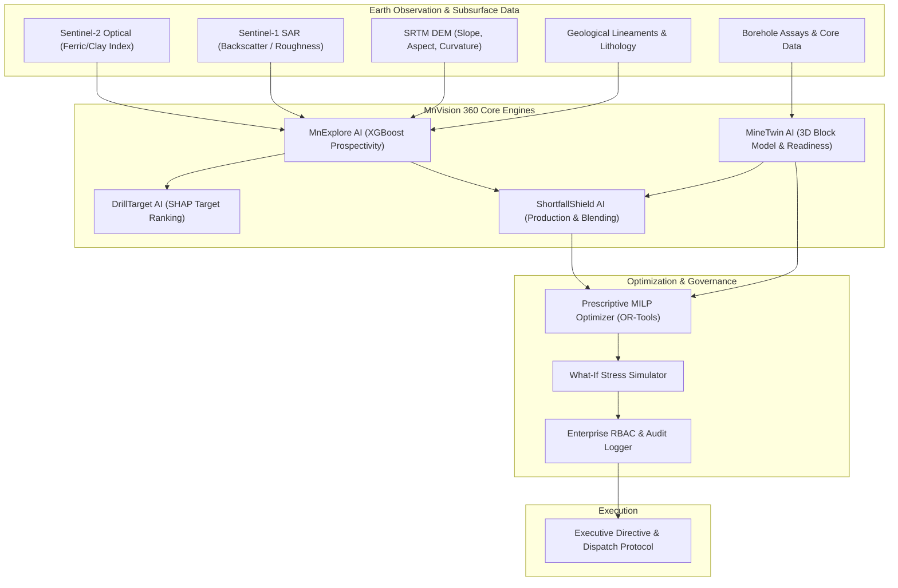
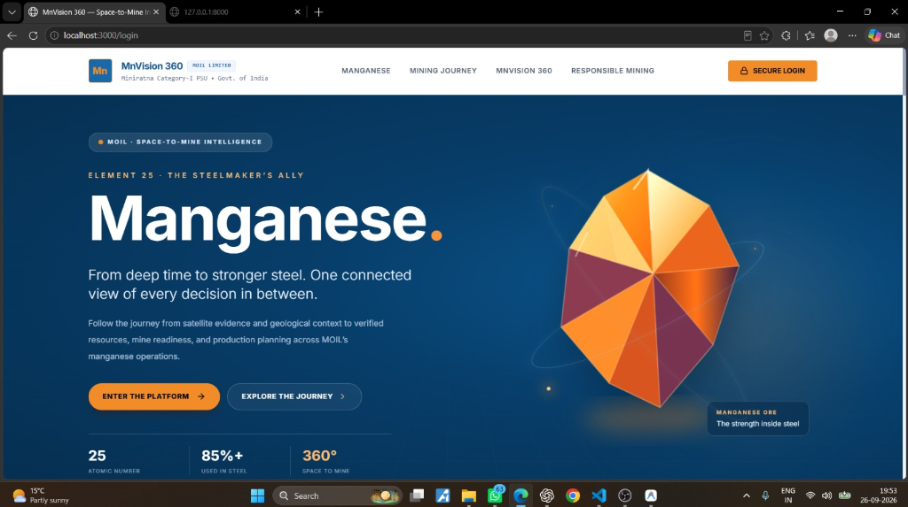
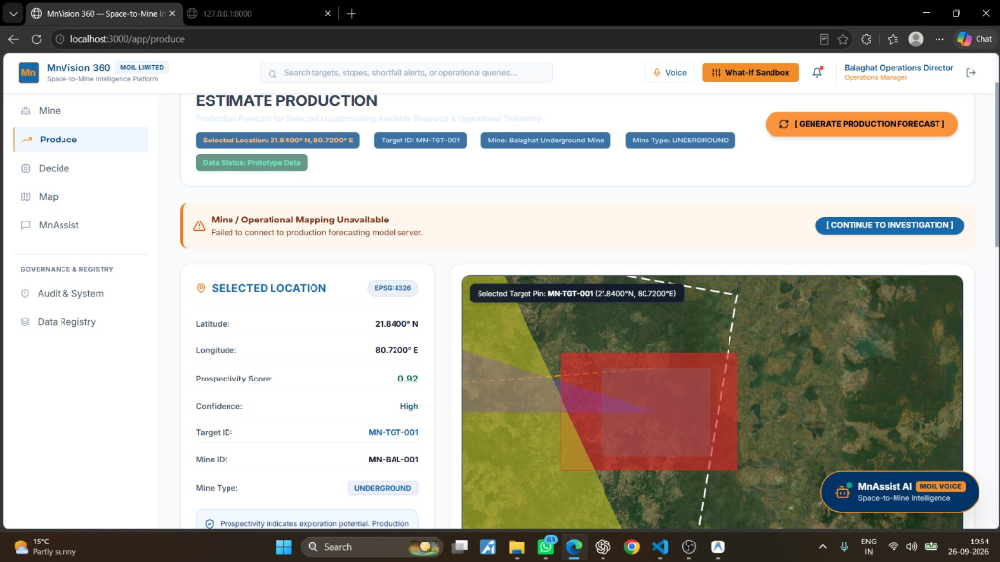
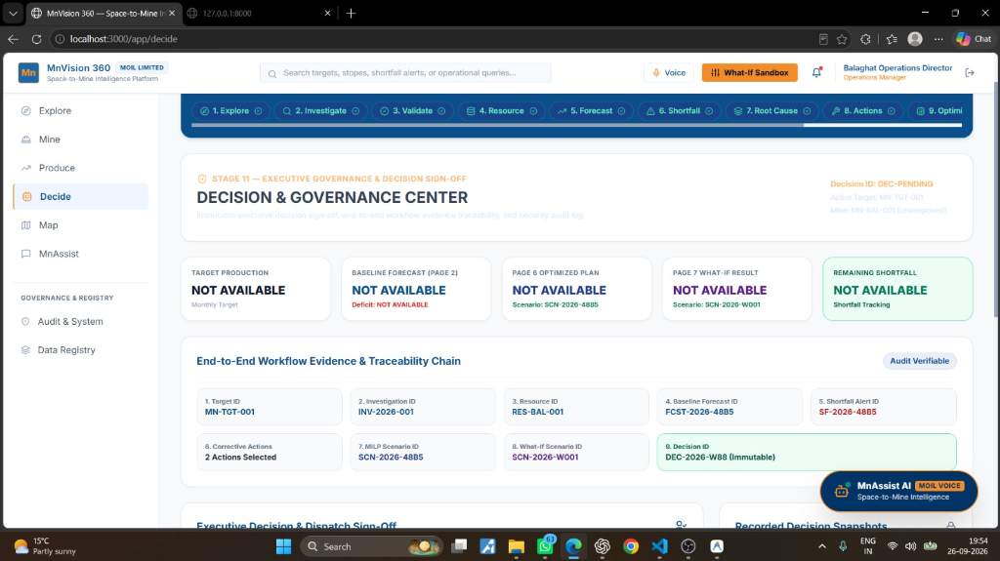

# MnVision 360 — Space-to-Mine Intelligence Platform

[](README.md#team--problem-statement-context)
[](walkthrough.md)
[](README.md#current-implementation-status)
[](LICENSE)
[](README.md#overview)

> **📖 Quick Navigation**: Jump directly to the step-by-step operational demonstration in the **[Full Walkthrough & SIH Demonstration Guide](walkthrough.md)**.

---

## Team & Problem Statement Context

- **Problem Statement**: Space-to-Mine Intelligence Platform for Manganese Prospectivity Mapping, Resource Estimation, & Operational Shortfall Risk Mitigation
- **Target Organization**: **MOIL (Manganese Ore India Limited)** — Miniratna Category-I PSU, Govt. of India (Nagpur / Balaghat Operations)
- **Solution Name**: **MnVision 360**
- **Repository**: [Gaurav-ux16/MnVision-360](https://github.com/Gaurav-ux16/MnVision-360)

---

## Overview

**MnVision 360** is an enterprise decision-support Web GIS & AI platform engineered specifically for **MOIL (Manganese Ore India Limited)**. It unifies surface satellite earth observation, multi-source geospatial prospectivity mapping, 3D underground block modeling, machine learning production forecasting, and prescriptive MILP (Mixed Integer Linear Programming) decision optimization into a single, closed-loop command center.

### Core Scientific Principle: Layered Prospectivity
The platform **never claims to directly detect underground manganese ore from satellite imagery**. Instead, it fuses surface earth observation (Sentinel-2 MSI, Sentinel-1 SAR, SRTM DEM) with geological mapping, structural lineaments, magnetic anomalies, and historic borehole assays into an explainable, physics-calibrated prospectivity surface.

---

## End-to-End System Architecture



### 7-Step Closed-Loop Pipeline
`PREDICT` $\rightarrow$ `EXPLAIN` $\rightarrow$ `EVALUATE` $\rightarrow$ `OPTIMIZE` $\rightarrow$ `SIMULATE` $\rightarrow$ `DECIDE` $\rightarrow$ `LEARN`

---

## Visual Platform Interface Tour

### 1. Platform Command Center & Landing Portal
*Executive entry point presenting MOIL manganese intelligence telemetry, active mining zones, and platform core modules.*



---

### 2. MnExplore AI — Balaghat & India Geospatial Intelligence Map
*Interactive Web GIS mapping continuous manganese prospectivity surfaces generated from GeoTIFF rasters, structural fault lineaments, and satellite evidence layers.*


**Capabilities**:
- Multi-layer spatial toggles (Prospectivity Heatmap, SRTM DEM, Geological Faults, Borehole Assays).
- SHAP feature attribution (explaining model prospectivity confidence per grid cell).
- India-wide & Balaghat district focused prospectivity zoom.

---

### 3. ShortfallShield AI — Production Forecasting & Mine Inspector
*Production forecasting engine with location inspector, risk alert thresholds, and underground mine mapping.*



**Capabilities**:
- 7, 15, and 30-day production volume and grade deficit prediction.
- Integration with MineTwin distinguishing **Total Reserve**, **Mineable Ore**, and **Operationally Ready Ore**.
- Grade blending constraint solver for stope extraction planning.

---

### 4. Executive Decision & Governance Center
*Immutable executive governance center displaying end-to-end evidence traceability, MILP optimizer outputs, and What-If scenario simulations.*



**Capabilities**:
- Prescriptive equipment and stope schedule optimization.
- What-If scenario sandbox (monsoon delay, power grid failure, excavator downtime).
- Audit-verifiable immutable decision dispatches.

---

## Current Implementation Status

All 8 major platform phases and engineering modules are **100% Complete & Operational**.

| Phase / Module | Description | Status | Verification |
| :--- | :--- | :---: | :--- |
| **Phase 1: Foundation & GIS Scaffold** | FastAPI backend, React Vite frontend, PostGIS spatial database schema | ✅ Complete | Verified clean build & API endpoints |
| **Phase 2: Balaghat AOI Engine** | Spatial bounding boxes, coordinate reference systems (EPSG:4326 / UTM 44N) | ✅ Complete | Balaghat vector boundaries & raster tiles active |
| **Phase 3: Satellite Harmonization** | Sentinel-2 spectral ratios (Ferric, Ferrous, Clay), Sentinel-1 SAR & DEM | ✅ Complete | Automated raster processing pipeline working |
| **Phase 4: MnExplore & DrillTarget AI** | XGBoost prospectivity model, SHAP feature explainer, Target clustering | ✅ Complete | Model trained & spatial predictions served |
| **Phase 5: MineTwin 3D Block Model** | Underground stope discretization (Reserve vs Mineable vs Ready Ore) | ✅ Complete | 3D Block model APIs & status inspector active |
| **Phase 6: ShortfallShield Forecast** | Time-series production forecasting, silica/phosphorus impurity solver | ✅ Complete | Forecast engine running with live alerts |
| **Phase 7: Executive Decision Engine** | Google OR-Tools MILP optimizer, What-If simulator, Directive logger | ✅ Complete | Prescriptive dispatch & simulation active |
| **Phase 8: Enterprise RBAC & Security** | JWT Authentication, multi-role views, MLflow experiment auditing | ✅ Complete | Multi-role security & auditing verified |

---

## Testing & Engineering Verification

MnVision 360 includes automated unit and integration tests across backend microservices and geospatial algorithms to ensure production stability.

### Running Backend Tests (pytest)
```bash
# Navigate to backend directory
cd backend

# Run full pytest suite
pytest -v

# Run with coverage report
pytest --cov=app --cov-report=term-missing
```

### Running Frontend Tests
```bash
# Navigate to frontend directory
cd frontend

# Run frontend unit tests
npm test
```

---

## Technology Stack

- **Frontend**: React 18, Vite, TypeScript, Tailwind CSS, MapLibre GL JS, Recharts, Lucide Icons.
- **Backend**: Python 3.11, FastAPI, Pydantic v2, SQLAlchemy 2.0, GeoAlchemy2, Uvicorn.
- **Geospatial & Spatial DB**: PostgreSQL 15, PostGIS 3.4, GeoPandas, Rasterio, Shapely, PyProj.
- **Machine Learning & Optimization**: XGBoost, scikit-learn, SHAP, Google OR-Tools (MILP), Isolation Forest.
- **Infrastructure & MLOps**: Docker, Docker Compose, Nginx, MinIO Object Store, MLflow.

---

## Quick Start (Docker)

### 1. Clone & Configure Environment
```bash
git clone https://github.com/Gaurav-ux16/MnVision-360.git
cd MnVision-360
cp .env.example .env
```

### 2. Launch Stack with Docker Compose
```bash
docker compose up --build -d
```

### 3. Service Endpoints
- **Frontend Command Center**: [http://localhost](http://localhost) (or port 3000 in dev)
- **FastAPI Documentation**: [http://localhost/api/docs](http://localhost/api/docs)
- **Backend Health Check**: [http://localhost/health](http://localhost/health)
- **PgAdmin Database Console**: [http://localhost:5050](http://localhost:5050)
- **MinIO Object Store**: [http://localhost:9001](http://localhost:9001)
- **MLflow Tracking Server**: [http://localhost:5000](http://localhost:5000)

---

## Role-Based Access Credentials (RBAC)

| Role | Username | Password | Access Rights |
| :--- | :--- | :--- | :--- |
| **System Admin** | `admin` | `Admin@123` | Full access across all modules, configuration & user management |
| **Exploration Director** | `director_geo` | `Geo@1234` | MnExplore AI, DrillTarget AI ranking, satellite spectral layer management |
| **Mine Ops Manager** | `ops_manager` | `Ops@1234` | MineTwin 3D block model, stope readiness, shift schedules |
| **Chief Metallurgist** | `metallurgist` | `Meta@1234` | ShortfallShield AI, grade blending constraints, silica/phos limits |
| **Field Geologist** | `field_geo` | `Field@1234` | Core logging data entry, target ground-truthing, field assay upload |

---

## License

This project is licensed under the MIT License - see the [LICENSE](LICENSE) file for details.
